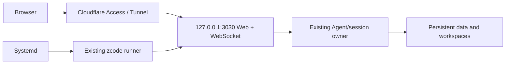

# no22 Linux x64 VPS distribution

## Product and boundaries

- CI runs natively on Ubuntu 22.04 x64 for a glibc-based Debian 12+/Arch x64 VPS. No macOS cross-compilation or ARM build matrix.
- Reuse build:zcode as the sole distribution assembler (Agent, server, Web, runtime dependencies). Add opt-in --archive-only: no download base URL required, produce only the versioned archive and checksum, no installer/index. Existing normal build behavior is unchanged.
- CI derives <root version>-no22.<run number>.<attempt> and stamps the root manifest only in the ephemeral checkout before compiling, so Web/server/Agent/package report the same version. No source release-version churn during upstream merges.
- Main pushes and manual dispatch build and verify. Publish a GitHub Actions artifact only after smoke checks pass. Archive contents include deploy/README.md and deploy/zcode.service. No automatic GitHub Release or VPS deployment.
- Runtime requires Node 24 (pinned build version from mise.toml), git and a normal Linux shell environment; native browser tooling may require separate browser installation. Do not bundle account credentials or workspace data.
- systemd runs the existing runner as a dedicated non-root user with persistent data outside /opt/zcode, fixed loopback port 3030, --no-open and --no-token. Cloudflare Access supplies external authentication; cloudflared forwards HTTP and WebSocket to loopback. Do not change application authentication or session ownership.
- systemd owns process restart and termination; the existing server/runtime owns sessions and persistence. UI disconnection is separate from service shutdown; restarting/upgrading can interrupt in-flight work and is not a task-resume guarantee.

## Validation

- CLI argument regression tests: archive-only does not need a base URL and does not create installer/index; normal mode still requires a base URL and creates them.
- CI: frozen dependency install, typecheck, lint, architecture check, build all distribution outputs, unpack outside checkout. Verify version, TUI native import/render/keyboard exit, HTTP/static page, expected workspace, WebSocket and SIGTERM shutdown via existing distribution smoke script.
- Validate systemd unit syntax in Linux CI. Upload .tar.gz + sha256.txt with finite retention after validation succeeds.
- Observe an actual GitHub Actions run for this commit; failures must be fixed or reported with exact boundaries. Do not claim remote VPS or Cloudflare deployment was tested by CI.
