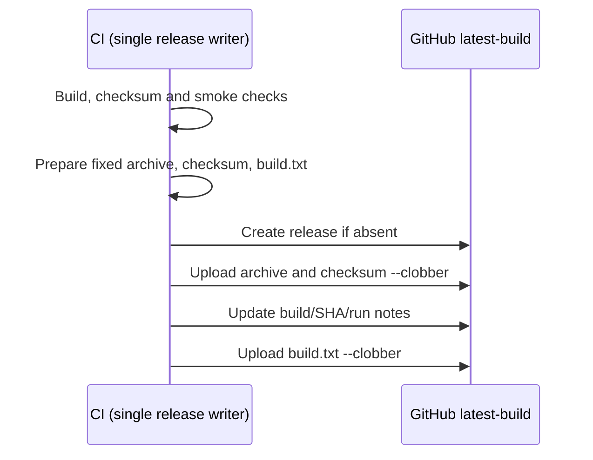
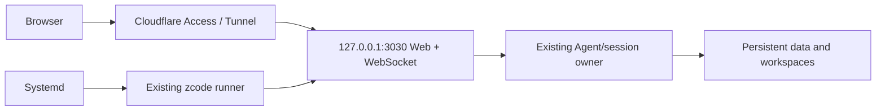

# no22 Linux x64 VPS distribution

## Product and boundaries

- CI runs natively on Ubuntu 22.04 x64 for a glibc-based Debian 12+/Arch x64 VPS. No macOS cross-compilation or ARM build matrix.
- Reuse build:zcode as the sole distribution assembler (Agent, server, Web, runtime dependencies). Add opt-in --archive-only: no download base URL required, produce only the versioned archive and checksum, no installer/index. Existing normal build behavior is unchanged.
- CI derives <root version>-no22.<run number>.<attempt> and stamps the root manifest only in the ephemeral checkout before compiling, so Web/server/Agent/package report the same version. No source release-version churn during upstream merges.
- Main pushes and manual dispatch build and verify. Only after smoke checks pass, retain the versioned Actions artifact and publish the rolling GitHub prerelease `latest-build`. Archive contents include deploy/README.md and deploy/zcode.service. No VPS deployment.
- The workflow is the single release writer, with repository-wide `linux-x64-latest-build` concurrency and no cancellation of an active run. Each successful publication replaces `zcode-linux-x64.tar.gz`, `sha256.txt`, and `build.txt` using `gh release upload --clobber`. The checksum names the fixed archive filename; `build.txt` contains the full stamped build version on the first line and `Build time (UTC): <ISO 8601 timestamp>` on the second line, suitable for `cat` or `curl`. Capture this timestamp once during version stamping immediately before compilation, then pass it to publication; it is not the upload time.
- Create the release/tag if absent, targeting the build commit; keep the tag as a stable download anchor. The tag's initial commit is not the current asset version: `build.txt` and release notes identify the actual build, and notes include its source SHA and Actions run URL. Rerunning a job produces a distinct attempt version and replaces the same assets. Manual runs intentionally publish their selected ref, including older refs.
- Prepare all files before remote writes. Upload archive/checksum first, then update notes, then upload `build.txt` last. GitHub asset replacement is not atomic; an upload failure fails CI and may leave mixed assets, so consumers must verify the checksum and retry after publication completes. A retry repairs the same fixed assets.

- Runtime requires Node 24 (pinned build version from mise.toml), git and a normal Linux shell environment; native browser tooling may require separate browser installation. Do not bundle account credentials or workspace data.
- systemd runs the existing runner as a dedicated non-root user with persistent data outside /opt/zcode, fixed loopback port 3030, --no-open and --no-token. Cloudflare Access supplies external authentication; cloudflared forwards HTTP and WebSocket to loopback. Do not change application authentication or session ownership.
- systemd owns process restart and termination; the existing server/runtime owns sessions and persistence. UI disconnection is separate from service shutdown; restarting/upgrading can interrupt in-flight work and is not a task-resume guarantee.

## Validation

- CI keeps the existing pnpm store cache and adds an exact-input TypeScript cache (emitted package outputs, host outputs and build-info files). Its key includes OS/architecture, pinned toolchain, dependency lock/config, patches and all package/CLI TypeScript inputs and manifests. No prefix fallback: deleted/changed sources get a cold cache. Always rerun typecheck and all validations after restore. Save immediately after validation and before version stamping/build so release bundles never enter this cache. Release assembly and smoke checks always run. Verify both a cold fill and a warm rerun in Actions before claiming a speedup.

- CLI argument regression tests: archive-only does not need a base URL and does not create installer/index; normal mode still requires a base URL and creates them.
- CI: frozen dependency install, typecheck, lint, architecture check, build all distribution outputs, unpack outside checkout. Verify version, TUI native import/render/keyboard exit, HTTP/static page, expected workspace, WebSocket and SIGTERM shutdown via existing distribution smoke script.
- Validate systemd unit syntax in Linux CI. Upload .tar.gz + sha256.txt with finite retention after validation succeeds.
- Test first publication, existing release replacement, exact build.txt/checksum contents and upload failure stopping before build.txt publication with a mocked gh CLI. Run these tests in CI. No application interaction changes or additional UI E2E scenarios.
- Observe an actual GitHub Actions run for this commit; failures must be fixed or reported with exact boundaries. Do not claim remote VPS or Cloudflare deployment was tested by CI.
