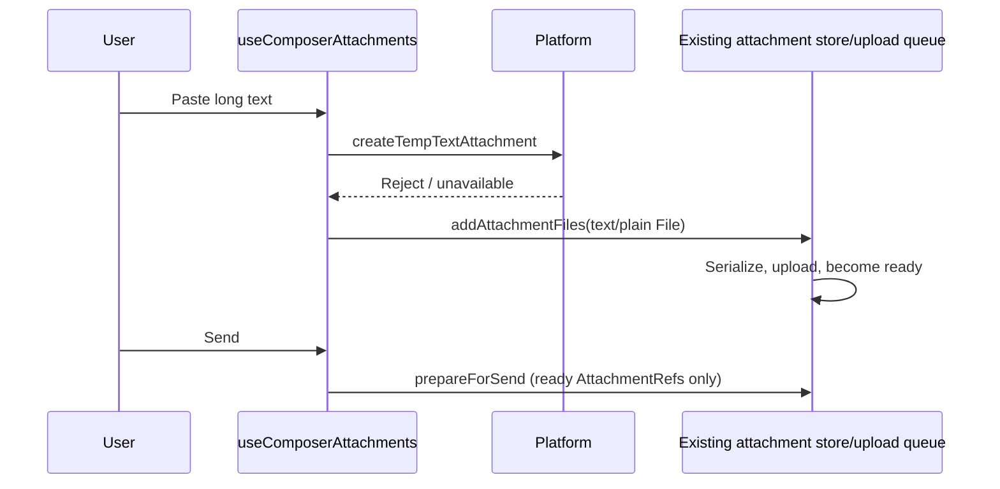

# Web sidebar and long clipboard text

## Rules and ownership

- Web renders an always-visible sidebar icon in DesktopTopOverlay, including touch devices. WebSidebarToggle delegates to onToggleSidebar; the existing shell remains the sole sidebar state owner. Desktop caption controls stay unchanged.
- At 15 \* 1024 characters or more, paste is consumed once. If native temporary text attachment creation fails or is unavailable, create a text/plain File with the existing clipboard filename helper and pass it to addAttachmentFiles. Ordinary upload limits, readiness, retry and error reporting apply.
- Keep the existing native path on success and normal paste below the threshold. No protocol or persistence migration.
- WorkspaceShellLayout currently auto-collapses only after a window resize. Manual expansion alone must not close the sidebar. Change this policy only if the reported immediate collapse is reproduced.
- Drawer conversion is out of scope.

## Event order

Remote staging/adoption, scope identity and Desktop continuous / Web replayable delivery remain owned by the existing pipeline.

## Acceptance and E2E scenarios

1. Web at 390x844 with no hover: sidebar toggle is visible while closed and open; tap twice to open then close. Leave open past the resize debounce and verify it stays open without resizing. Repeat on wide Web; desktop retains its original controls.
2. Paste 15359 characters: ordinary editor insertion, no attachment. Paste 15360 and 20000 characters with native temp creation rejected or absent: exactly one .txt chip, no read-failed error; upload then send and verify the received UTF-8 content and attachment reference.
3. Native creation success keeps the local path and creates no fallback File. Attachment upload failure remains retryable and blocks send under existing rules.
4. Resize a narrow conversation: existing resize-only collapse still runs. Opening a sidebar does not itself dispatch window resize.

The existing general text serializer truncates content above 64 \* 1024 characters; this patch does not change that separate limit.

## Verification (2026-09-24)

- `pnpm exec tsx --tsconfig packages/ui/tsconfig.json --test packages/ui/test/mobilePatches.test.ts`: 5 passed. Four fallback cases failed before the fix. Real serialization/upload mapping is exercised with a simulated upload endpoint; UTF-8 bytes and returned refs are checked.
- `node packages/ui/test/mobilePatches.e2e.mjs` against `pnpm dev:web`, installed Chrome and the available `playwright-core`: passed at 390x844 with touch and 1280x900. Manual expansion stayed open beyond the 300ms resize debounce. WorkspaceShellLayout remains unchanged.
- Browser send check: pasted 16061 synthetic characters, saw a .txt chip, sent it with a synthetic no-tools prompt, and observed the attachment in the user message. Model response entered reconnect retries; model-side reading/completion was not verified.
- Node 24.14.0: `pnpm typecheck` passed; `pnpm lint` completed with 0 errors and 70 existing warnings.
- `pnpm architecture:check --changed`: 0 violations, 0 baseline, 0 new. Existing ui module; no ownership or protocol changes.
