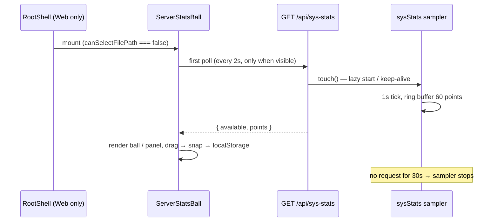

# Server stats floating ball

## Rules and ownership

- `packages/server/src/sysStats.ts` is the single owner of system sampling. It reads `/proc` directly (no new dependencies): CPU from `/proc/stat` (usage from the delta of two samples, idle includes iowait), memory from `/proc/meminfo` (used = MemTotal − MemAvailable; `os.freemem()` is not used because it counts cache as used), network from `/proc/net/dev` (sum rx/tx bytes of all interfaces except `lo`, rate = delta ÷ interval, counter resets clamp to 0). Each point also carries `os.loadavg()`, uptime (`/proc/uptime`), and the server process RSS (`process.memoryUsage().rss`).
- The sampler ticks once per second and keeps the most recent 60 points. It starts lazily on the first `GET /api/sys-stats` request and stops by itself after 30 seconds without a request, so an unwatched server does no sampling work. The timer is unref'd.
- `GET /api/sys-stats` (registered in `packages/server/src/http.ts`) returns `{ available, points }`. On non-Linux hosts (no readable `/proc`) it reports `available: false` with empty points instead of failing. The route sits under the existing `/api/*` token middleware; no extra auth (Cloudflare Access stays the outer boundary).
- `packages/ui/src/components/ServerStatsBall.tsx` owns presentation and is mounted once in `packages/ui/src/root/RootShell.tsx`. It renders only on Web (`platform.canSelectFilePath === false`); desktop renders nothing. If a poll fails or reports `available: false`, the ball hides and polling stops (retried on the next visibility transition), so desktop origins and non-stats servers never show it.
- Polling: every 2 s; paused while `document.hidden`, resumed on return. 60 points × 1 s sampling covers the visible window.
- Collapsed state: a `position: fixed` ball showing CPU% and memory%, recolored at >80% (warning) and >95% (destructive) using semantic color tokens. Expanded state: a small panel with SVG-polyline mini charts (CPU, memory, down/up rate) fed by the returned points — no chart library.
- Dragging: pointer events with a click threshold to toggle expand; on release the ball snaps to the nearest horizontal edge; position (`side` + top offset) persists in `localStorage` under `zcode:server-stats-ball`; clamping accounts for `env(safe-area-inset-*)` (measured once) so the ball never hides under mobile browser chrome or covers the bottom input area.

## Event order

## Acceptance scenarios

1. On the VPS web deployment the ball appears, CPU%/mem% update every 2 s, colors cross the 80/95 thresholds, and the panel shows four mini charts over the last 60 s.
2. Switching the tab to background stops network polling; returning resumes it without duplicate intervals.
3. Dragging the ball to another half of the screen snaps it to the nearest edge, the position survives a reload, and the resting position stays inside the safe-area bounds on mobile (no overlap with browser chrome).
4. On desktop, or when `/api/sys-stats` is unavailable, nothing renders and no recurring failing requests are made.
5. macOS dev server returns `{ available: false }` without crashing; Linux sampling produces monotonic points with plausible CPU/rate deltas.

## Verification (2026-09-25)

- Node 24.14.0 (fnm), `pnpm exec tsx --test packages/server/test/sysStats.test.ts`: passed — `/proc/stat` delta math (idle+iowait), kB→bytes conversion with `MemFree` fallback, `/proc/net/dev` sums excluding `lo`; sampler availability: on this machine `/proc` is absent, first `touch()` now returns `{available:false}` synchronously (fixed a bug where the first response claimed available before the baseline sample finished); on Linux the same branch asserts a first point with real `memTotalBytes`.
- Node 24.14.0, `pnpm exec tsx --test packages/server/test/httpUpload.test.ts` also covers `GET /api/sys-stats` returning 200 under the same `/api/*` middleware.
- Component rendering/drag/poll behavior was reviewed against DESIGN.md tokens (`text-ui-*`, `bg-popover`, `text-warning`/`text-destructive`) and toast.tsx safe-area precedents; pixel-level mobile check (scenario 3) needs the real VPS + phone browser and was not exercised locally. Desktop hiding is enforced by `platform.canSelectFilePath === false`.
- `pnpm typecheck` passed; `pnpm lint` 0 errors / 70 pre-existing warnings; `pnpm architecture:check --changed` 0 violations.
