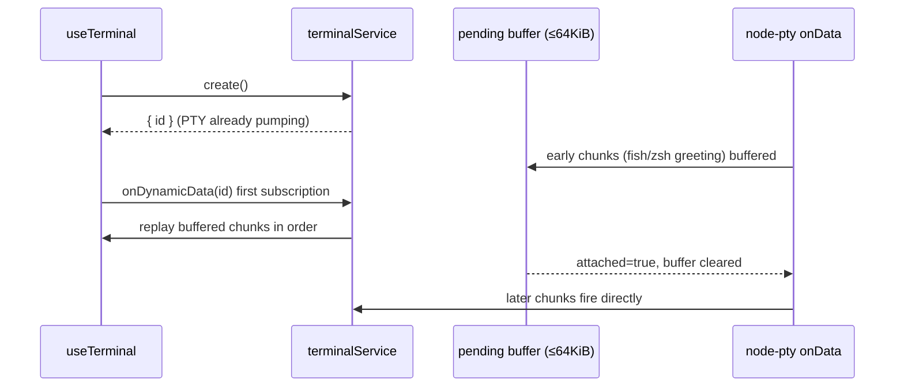

# Terminal startup output buffer

## Rules and ownership

- `packages/services` `createTerminalService` is the single owner of per-terminal PTY output. Each terminal record holds a pending buffer (`packages/services/src/terminal/terminalPendingBuffer.ts`, capacity 64 KiB) next to its data emitter.
- `create()` registers the PTY `onData` pump immediately. While no dynamic-data subscriber has attached, chunks are appended to the pending buffer; when the buffer exceeds 64 KiB the oldest chunks are dropped (a single chunk larger than the whole cap is dropped entirely, keeping the bound strict). The live emitter is still fired — buffering never becomes a second delivery path.
- The first `onDynamicData(id)` subscription synchronously replays the buffered chunks in arrival order to that listener, then marks the buffer attached and clears it. Afterwards PTY chunks flow straight through the emitter. Subscriptions after the first get live data only (reconnect replay stays out of scope).
- Exit and `cleanupTerminal` drop the buffer together with the record; nothing is replayed after the terminal is gone.

## Event order

Failure semantics: if the terminal exits before any subscription, buffered data is discarded with the record; the exit event path is unchanged. The 10-second reconnect warning window on slow shells (fish profile startup) no longer loses output created between `create()` and the first subscription.

## Acceptance scenarios

1. Unit: chunks pushed before the first `attach()` are replayed once, in order, to the first subscriber; a second subscriber receives no replay.
2. Unit: exceeding 64 KiB drops the oldest chunks; buffer byte size never exceeds the cap; a single oversized chunk is dropped whole.
3. Unit: after attach, `push` stops buffering and data reaches the live subscriber only.
4. Integration (real PTY, skipped when node-pty is unavailable): `create()` → immediate `write("echo marker")` → first subscription still observes the marker output.
5. Desktop/Web terminal panels show early shell greeting (fish) that was previously lost during the startup window.

## Verification (2026-09-25)

- Node 24.14.0 (fnm), `pnpm exec tsx --test packages/services/test/terminalStartupBuffer.test.ts`: 5 passed — replay once to the first subscriber only; 64 KiB cap drops oldest (and an oversized single chunk whole); no buffering after attach; and a real node-pty integration test (`create()` → immediate `echo zcode-race-marker-2` write → first subscription still observes the marker, 1.3s).
- `pnpm typecheck` passed; `pnpm lint` 0 errors / 70 pre-existing warnings; `pnpm architecture:check --changed` 0 violations.
