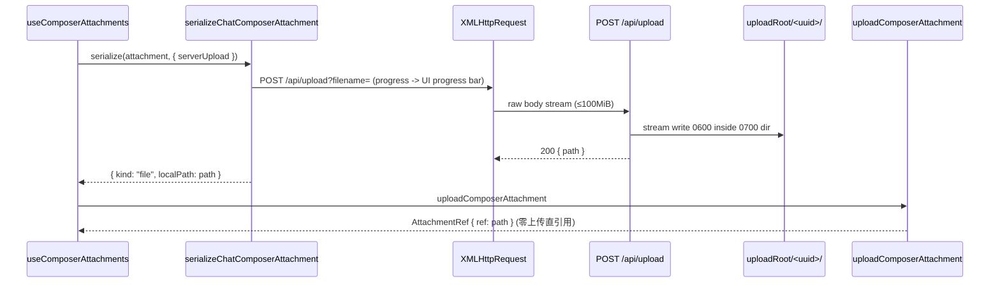

# Web composer server upload for pathless files

## Rules and ownership

- `packages/server` owns `POST /api/upload`. The filename comes from the `?filename=` query parameter and is reduced to its basename; empty names, `.`, `..`, and NUL bytes are rejected with 400. The raw request body is streamed (no buffering of the whole file) to `<uploadRoot>/<randomUUID>/<filename>`.
- `uploadRoot` is `ZCODE_UPLOAD_DIR` when set, otherwise `/var/tmp/zcode-uploads`. The upload root and the per-upload random-id directory are created with mode `0700`; uploaded files are written with mode `0600`. The final absolute target path must resolve inside the upload root (`isInsideDirectory`), otherwise 400.
- The request body is capped at 100 MiB (`SERVER_UPLOAD_MAX_BYTES`, Cloudflare free-plan request limit). The cap is enforced while streaming with a counting transform, so chunked bodies without `content-length` are covered too. Oversized uploads fail with 413 and the partial directory is removed.
- Success returns `{ path: <absolutePath> }`. `/api/upload` sits under the existing `/api/*` token middleware; no separate auth layer is added (Cloudflare Access remains the outer boundary in the VPS deployment).
- `packages/ui` `serializeChatComposerAttachment` owns the composer-side decision. Its final branch — a `File` is present, there is no `localPath`, and the file is not text-like — is extended with an opt-in `serverUpload` option: the File is POSTed to the same-origin `/api/upload?filename=...` via `XMLHttpRequest` (upload progress from `xhr.upload.onprogress`, abort via `AbortSignal`), and the serializer returns `{ kind: "file", localPath, filename, mimeType, sizeBytes }`. A client-side 100 MiB pre-check throws the structured `OversizedServerUploadAttachmentError` before any bytes are sent; the server-side 413 maps to the same error.
- Callers opt in only on Web (`platform.canSelectFilePath === false`). Desktop keeps the previous behavior unchanged (content-less file attachment, dropped later by `uploadComposerAttachment` with a warning). Text-like files and image/video/pdf branches are unchanged.
- `uploadComposerAttachment` stays unchanged: a `localPath` result is treated as a path reference, so the agent receives a server-side file path exactly like a desktop local path. Cleanup/GC of uploaded files and resumable uploads are out of scope.

## Event order

The upload happens inside the existing per-attachment queue slot, so it shares the current upload/readiness/retry/abort state machine; no second queue is introduced.

## Acceptance scenarios

1. Web: attach a non-text file (e.g. ZIP) without a local path → a `POST /api/upload` fires with progress driving the existing chip progress bar; the sent message carries an `AttachmentRef` whose ref is the returned absolute server path.
2. Filenames `../../etc/passwd`, `.`, `..`, empty, and `a/b.zip` never escape the upload root: the stored name is the basename only, and hostile values are rejected with 400 before writing.
3. A body larger than 100 MiB (with or without `content-length`) fails with 413, leaves no partial directory behind, and the chip shows the localized oversized message. Under 100 MiB it succeeds.
4. Desktop (serverUpload option absent) serializes a pathless non-text file exactly as before: no XHR, content-less attachment, later dropped with the existing warning.
5. Upload root `ZCODE_UPLOAD_DIR` is honored; when unset the default `/var/tmp/zcode-uploads` is created with `0700`.

## Verification (2026-09-25)

- Node 24.14.0 (fnm), `pnpm exec tsx --test packages/ui/test/chatAttachmentServerUpload.test.ts`: 6 passed — pathless non-text file POSTs to `/api/upload?filename=` with progress events and returns `{kind:"file", localPath}`; text-like files and desktop (no option) keep the old branches; oversized input throws the structured error before uploading; 413 maps to the same error; aborted signal cancels.
- Node 24.14.0, `pnpm exec tsx --test packages/server/test/httpUpload.test.ts`: passed — body stored under a `0700` dir as a `0600` file at the returned absolute path; `.`, `..`, empty, NUL filenames rejected with 400; `../../etc/passwd` reduced to basename inside the upload root; size limiter aborts beyond the cap; cap is 100 MiB.
- `pnpm typecheck` passed; `pnpm lint` 0 errors and 70 warnings (pre-existing baseline); `oxfmt --check` clean on changed files; `pnpm architecture:check --changed` 0 violations / 0 baseline / 0 new.
- Real-browser send flow over Cloudflare Access was not exercised locally (needs the VPS deployment); the XHR transport is covered by the stubbed-XHR serializer tests above.
