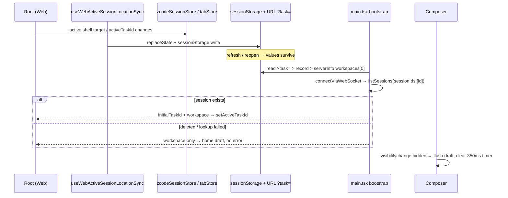

# Web refresh session restore and composer draft persistence

## Rules and ownership

- `packages/ui/src/root/webActiveSessionLocationSync.ts` owns the Web active-session location record. Root-level hook `useWebActiveSessionLocationSync` (Web only, `!isDesktop`) mirrors the active workspace shell target (`workspaceShellPath` / `workspaceShellIdentity`) plus the workspace's `activeTaskId` into:
  - `sessionStorage` key `zcode:web:active-session` as `{ sessionId?, workspacePath, workspaceIdentity? }` (sessionId omitted while in a fresh draft — draft session ids are renderer-local and cannot be restored as sessions); and
  - the URL as `?task=<sessionId>` via `history.replaceState` (other query params preserved; the param is removed when there is no active session). Desktop never writes the record or URL.
- `packages/web/src/main.tsx` owns bootstrap priority. `resolveWebBootstrap` resolves the initial context in this order: `?task=` URL param, then the stored session record, then the previous default `serverInfo.workspaces[0]`. The stored record's `workspacePath` / `workspaceIdentity` override the server-info default workspace; the resulting values feed Root's existing `initialTaskId` / `initialWorkspaceAbsPath` / `initialWorkspaceIdentity` params.
- Startup validation lives in `main.tsx` after `connectViaWebSocket`: when an initial task id was resolved, it calls `zcodeAgentService.listSessions({ workspacePath, workspaceIdentity?, sessionIds: [id], limit: 1 })`. If the session is gone, or the lookup itself fails, the task id is dropped and Root boots into the workspace home (draft) without an error surface. A missing/unparsable sessionStorage record degrades the same way.
- The sync hook clears the stored record when the active shell target disappears (welcome screen); it never throws on storage failures (private-mode Safari etc.).
- `packages/ui/src/v4/ConversationComposer.tsx` keeps its existing pagehide/blur flush and adds `document.visibilitychange`: when `document.visibilityState === "hidden"` it clears the 350 ms draft debounce timer and runs `persistDraftNow(draftScopeRef.current)` immediately. This is the reliable background signal on mobile browsers. Attachment-less draft persistence is unchanged (File objects are intentionally not persisted).
- Sidebar visibility stays owned by `useAppPanels` (`isSidebarVisible`). The value is now seeded from `localStorage` (`zcode:sidebar-visible`, default open) and persisted on change via effect, so refresh keeps the last open/closed state on Web and Desktop. Storage failures are silently ignored.
- Web sidebar toggle (`WebSidebarToggle`) renders the same state-aware icon pair as desktop (`PanelLeftClose` when open, `PanelLeftOpen` when closed), receiving `sidebarVisible` from `DesktopTopOverlay`.

## Event order

## Acceptance scenarios

1. Open a repo session on Web, refresh: the same session is active again (initialTaskId restored via stored/URL values) and the composer draft reappears from the persisted draft store.
2. Refresh a workspace with only a fresh draft (no session yet): lands on that workspace's home draft; no error.
3. Delete the stored session server-side (or corrupt the record), then refresh: workspace home renders, no error toast; the stale `?task=` param is cleaned from the URL by the sync hook.
4. Type on mobile Web, immediately switch apps (background), return: the draft text is still in the composer.
5. Toggle the sidebar closed, refresh: it stays closed; open + refresh stays open.
6. Desktop behavior unchanged except sidebar visibility now also survives renderer reload; desktop never mutates the URL.

## Verification (2026-09-25)

- Node 24.14.0 (fnm): `pnpm typecheck` passed; `pnpm lint` 0 errors / 70 pre-existing warnings; `pnpm architecture:check --changed` 0 violations; `oxfmt --check` clean on changed files; `packages/ui/test/webSessionRestore.test.ts` 4 passed (record parse/validate/fallback + sidebar preference round-trip), existing ui tests still 11 passed.
- Live `pnpm dev:web` + in-app browser walkthrough (1280×900 and 390×844):
  - Opening a session writes `sessionStorage["zcode:web:active-session"]` (`{workspacePath, sessionId}`) and `?task=<id>` via replaceState; a draft-only home writes the record without sessionId.
  - Manual reload with the recorded session: same session re-activated, composer draft restored verbatim, `?task=` preserved.
  - Simulated backgrounding (override `visibilityState` → dispatch `visibilitychange` → immediate reload, no debounce window): draft still restored, proving the hidden-flush path.
  - Hostile state (tampered `sessionId` in the record, URL `task` removed): reload shows no error boundary; the renderer falls back to the workspace context (home draft, or the locally persisted last valid session when the tampered record disagrees with local state — real deletions leave both pointing at the deleted id, which then lands on the home draft).
  - Sidebar: resize auto-collapse persisted as closed (`zcode:sidebar-visible=0`), re-open persisted as `1`; reload keeps the state in both cases.
  - Sidebar toggle icon: measured insets 6/6/6/6 (geometrically centered); the actual defect was the Web overlay missing the desktop `pl-3` left inset (button flush at x=0) — fixed and verified at both widths (button x=12).
- Not exercised locally: real mobile-device safe-area/browser-chrome behavior and Cloudflare Access deployment; the flows above used desktop Chrome-equivalent rendering.
